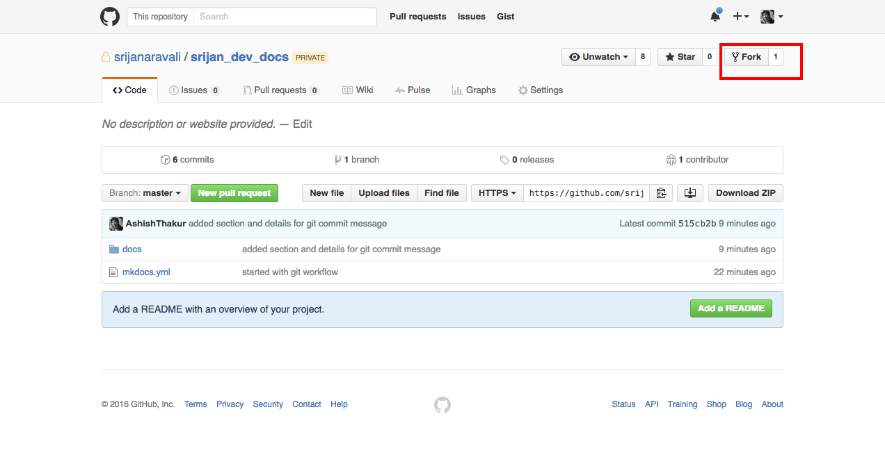
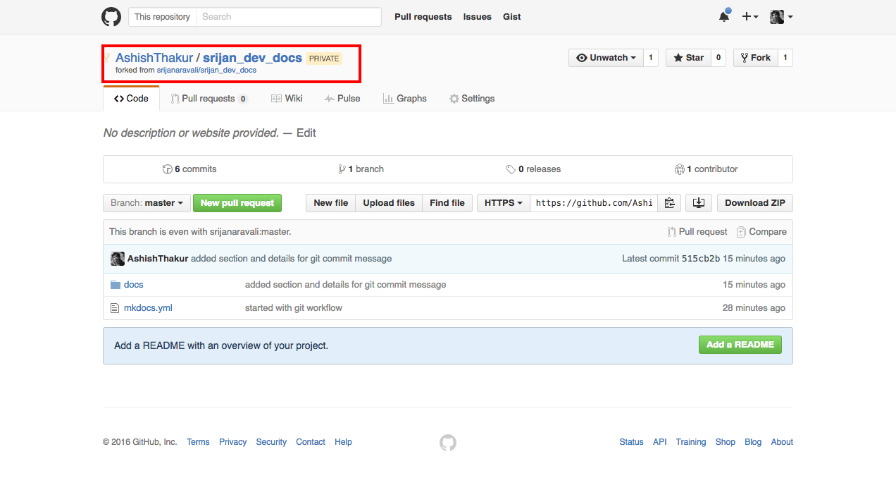
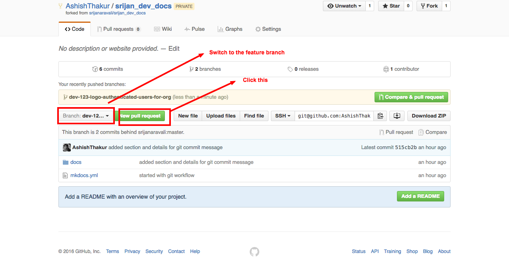
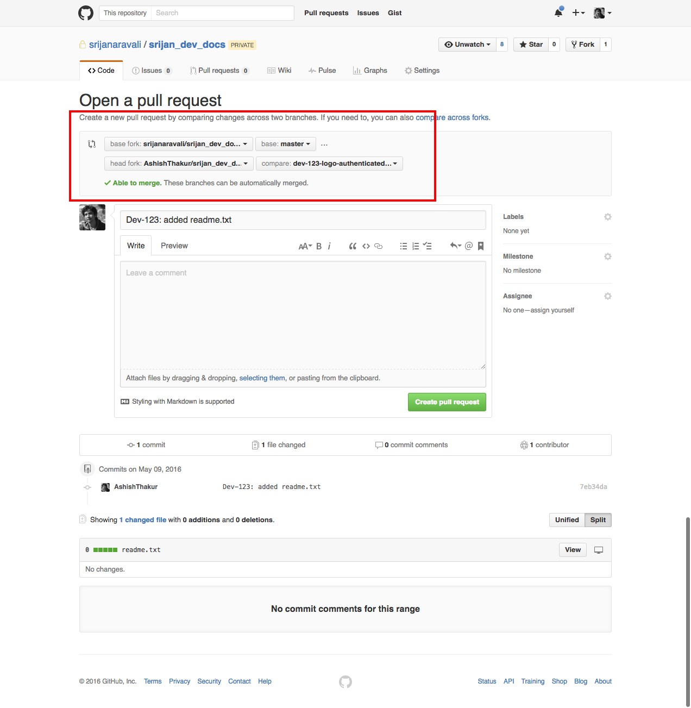
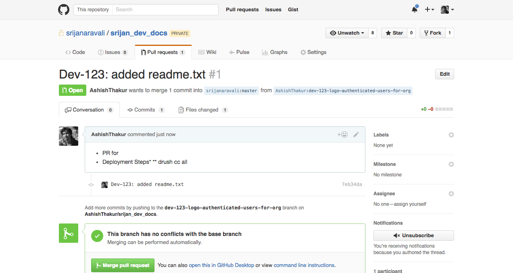
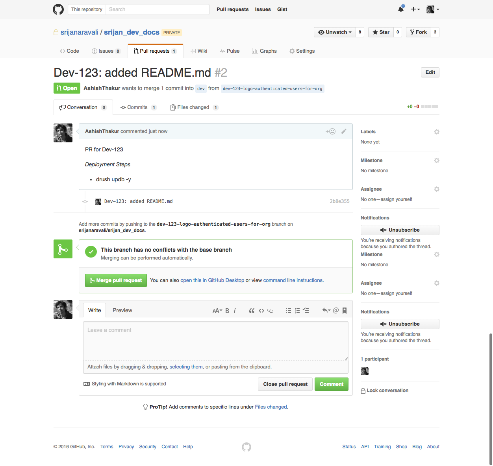

# Git Workflow

## Introduction
This document highlights Git workflow which team at Srijan should use. It also contains conventions for naming
branches and remotes. We will introduce two workflows in this document. It is suggested to use the Workflow 1
(Github's fork based workflow) unless there is a special need to use Workflow 2.

## Branch name conventions
Both the workflow would follow per feature branch branching concept, so it is crucial to follow a similar branching
name convention.

It is assumed that your project uses some ticketing tool(Jira etc) to run sprints and each team member is assigned
tickets in the sprint to develop/fix. Since we would be following per feature branch which should follow following
naming convetion and please use lowercase to name your feature branches.

```
<ticket-number>-<description-of-the-ticket>
```

*Example*

* Ticket no. Assigned: Dev-123
* User story: As an authenticated user I should be able to view my organization's logo instead of site logo when I
navigate to my organization page.

Considering the above example the branch name could be
```
dev-123-logo-authenticated-users-for-org
```

## Git commit messages
* Start your git commit message with the ticket number of the feature you are working. Example ```Dev-123: added template
for logo"
* Git commit messages should highlight the work which you are saving in that particular commit. Please avoid generic
commit messages like "added css"
* Git commit messages should not contain any typos
* Use ```git commit --amend``` in case you want to add/modify something to your last commit
* [Refer](http://chris.beams.io/posts/git-commit/) for more
* In case your commit message does not follow above points it is likely that the pull request might get rejected and you
might have to make changes in your commit messages. Please read [this](https://help.github.com/articles/changing-a-commit-message/)
to understand the process of changing git commit messages

## Git Workflows

### Git Workflow 1

#### Architecture
* Each project would have an upstream repository hosted on Srijan account.
* [https://github.com/srijanaravali/srijan_dev_docs](https://github.com/srijanaravali/srijan_dev_docs) is an example of upstream remote which we would be using as an example in this document.

#### Steps
* Create a fork

* This would create(clone) the upstream repo to your personal github account

* Clone the forked repo ```git clone git@github.com:AshishThakur/srijan_dev_docs.git```
* Add upstream repo as a new remote named upstream ```git remote add upstream git@github.com:srijanaravali/srijan_dev_docs.git```
* It is important to follow similar conventions; while you clone your repo needs to be named as *origin* and the srijan repo needs
to be added a new remote named *upstream*. In case you have confusions regarding remote, please read about how remotes work in git.
* In case you have correctly followed the above steps ```git remote -v``` should give following output
```
Ashishs-MacBook-Pro:srijan_dev_docs ashish$ git remote -v
origin  git@github.com:AshishThakur/srijan_dev_docs.git (fetch)
origin  git@github.com:AshishThakur/srijan_dev_docs.git (push)
upstream        git@github.com:srijanaravali/srijan_dev_docs.git (fetch)
upstream        git@github.com:srijanaravali/srijan_dev_docs.git (push)
```
Note above my forked repo is named as *origin* and the srijanaravali/srijan_dev_docs is named as *upstream*

* Assuming your are working on the ticket number as specified in [Branch name conventions](git.md#branch-name-conventions), checkout to the base branch (taking dev as an example in this document, some teams might have sprint based base branches). It is important to checkout to base
branch while you create a new feature branch. ```git checkout dev```
* Create the feature branch ```git checkout -b dev-123-logo-authenticated-users-for-org```
* Finish the task locally and make sure to unit test everything on local and save the code in local repo.
* Pull the changes from upstream ```git pull --rebase upstream dev```. Traditional ```git pull``` creates a merge commit, hence to avoid this ```git pull --rebase``` is recommended.
* Fix the conflicts in case any.
* Push the feature branch to origin.
* Raise a pull request from your forked (origin)repo's feature branch to upstream's dev branch.



* Your team would review your code, please fix those changes and push the changes to the feature branch. Please note guidelines as described in [Git commit messages](git.md#git-commit-messages) have to followed for your commit messages. Avoid commit messages like ```git commit -m "fixed as per feeback"``` instead use amend or squash to keep the commit messages clean.

### Git Workflow 2

#### Architecture
* Each project would have an upstream repository hosted on Srijan account.
* [https://github.com/srijanaravali/srijan_dev_docs](https://github.com/srijanaravali/srijan_dev_docs) is an example of remote which we would be using as an example in this document.
* In this workflow you are not required to create the fork, you would maintain a single remote and name it origin.

### Steps
* Clone the repo: ```git clone git@github.com:srijanaravali/srijan_dev_docs.git```
* Checkout to the base branch: ```git checkout dev``` (dev is considered as a base branch in this example)
* Create the feature branch: ```git checkout -b dev-123-logo-authenticated-users-for-org``` (It is important to checkout to dev branch or your base branch before creating your feature branch)
* Finish your work locally and make sure to same commit messages guidelines as in Git Workflow 1
* Rebase your work with your base branch: ```git pull --rebase origin dev```. This is important before your push your feature branch
* Push your feature branch: ```git push origin dev-123-logo-authenticated-users-for-org```
* Raise a Pull Request to the base branch

* Your team would review your code, please fix those changes and push the changes to the feature branch. Please note guidelines as described in [Git commit messages](git.md#git-commit-messages) have to followed for your commit messages. Avoid commit messages like ```git commit -m "fixed as per feeback"``` instead use amend or squash to keep the commit messages clean.

## Other important points to consinder
